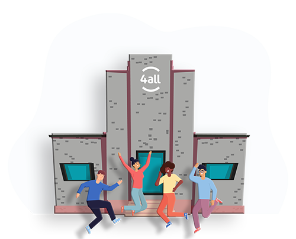
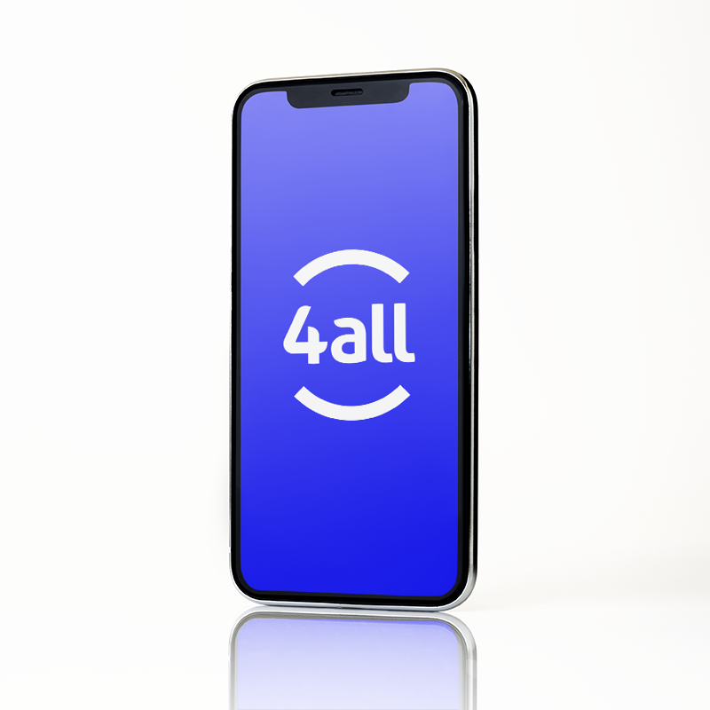

<h1 align="center">
  
   
  Go4All
   
</h1>

  

Go4All

 

  

## 📅 Sobre

Aplicação mobile desenvolvida para critérios de avaliação.

  

## 🌐 Tecnologias Usadas
Foram usadas essas tecnologias:

- [React Native](https://reactnative.dev/)
- [Yarn](https://yarnpkg.com/)
- [Expo](https://expo.io/)

*Foram usados outros Frameworks no projeto, mas esses são os principais.*

## ***</>*** Como usar o código?
1. Instale o **Yarn** em seu computador
1. Instale o **NodeJs**
1. Clone este repositório `git clone https://github.com/JhonatanBergmann/go4all.git`

### 📱 Mobile
1. Instale o **Expo** em seu celular.
1. Instale o **Expo CLI** com o comando `yarn global add expo-cli`
1. Acesse a pasta *mobile* e dê o comando `yarn install`
1. Acesse novamente a pasta *mobile* e dê o comando `yarn start`
1. Será aberto uma página no navegador com um *QR CODE*, leia-o com o aplicativo do **Expo**

## 📝 Licença

Esse projeto está sob a licença MIT. Veja o arquivo [LICENSE](LICENSE) para mais detalhes.

---

 Feito com 💜 by Jhonatan Bergmann

